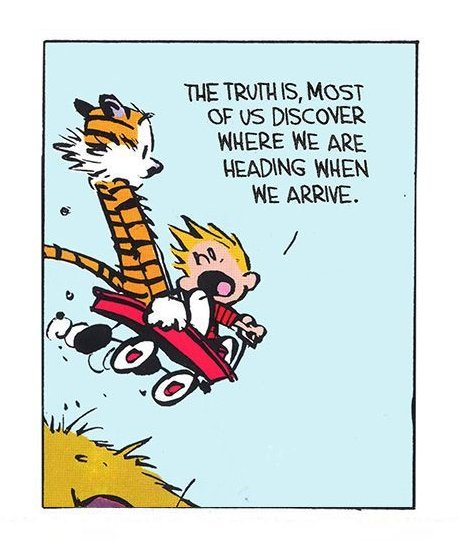

# Career



[Book summary: So Good They Can't Ignore You - by Cal Newport](https://sivers.org/book/SoGood) \#article - "Shockingly smart thoughts about your career. A must-read for anyone who is not loving their work, wanting to quit their job, and follow their passion, or not sure what to do next. I'm recommending this many times a week to people who email me with these kinds of questions. Best book I've ever read on the subject. See [https://commoncog.com/blog/so-good-they-cant-ignore-you/](https://commoncog.com/blog/so-good-they-cant-ignore-you/) for a better summary."

[Career Development Training and Tutorials](https://www.lynda.com/Career-Development-training-tutorials/1295-0.html?previousCategory=29) - Lynda.com / LinkedIn Learning. "Whether you're trying to find a new job, get a promotion, or excel in a new career, our training can help you achieve your career development goals. Our experts offer tips on leadership, management techniques, productivity, resume writing, and more."

[Great developers are raised, not hired](https://sizovs.net/2019/04/10/the-best-developers-are-raised-not-hired/?utm_source=hackernewsletter&utm_medium=email&utm_term=fav) \#article - "By building mentoring capacity at work, you can hire newcomers, broken toys, impostors and turn them into the loyal, high-quality workforce. Shifting focus from assessing to mentoring can simplify your interviewing process. Instead of trying to predict future performance by asking tough questions and sending candidate through nine circles of hell, you can hire candidates with a growth mindset and grow them."

[Jack Butcher on Twitter: "Publishing your ideas as you have them is dollar cost averaging for your reputation." / Twitter](https://twitter.com/jackbutcher/status/1329852224479113218) \#tweet - \#thread

[Lab Notes: My Closed-Loop Research System - Study Hacks - Cal Newport](https://www.calnewport.com/blog/2011/06/23/lab-notes-my-closed-loop-research-system/) \#article - "The best way to understand my research system is as a three-level pyramid \(illustrated at the top of this post\)." His iterative method of gathering, processing, and applying research in bite-sized experiments designed to get feedback.

[Lunchclub](https://lunchclub.ai/) - "Smart introductions to relevant people
. Curated 1:1 professional connections."

[MentorCruise](https://mentorcruise.com/) - "Your trusted source to find highly-vetted mentors & industry professionals to move your career ahead."

[Olmo](https://olmo.io/) - "Get connected to the right people. Just ask Olmo. Access to opportunities for career advancement and professional growth relies heavily on connections. Olmo is the first personalized networking concierge dedicated to connecting you to the right people. Stop chasing leads and focus instead on building relationships."

[Why Not Us? Full Length Documentary](https://www.bing.com/videos/search?q=roadtrip+nation+original&&view=detail&mid=1CE8BE498BB283D627FB1CE8BE498BB283D627FB&&FORM=VRDGAR) \#video \#documentary - By Roadtrip Nation. Four kids with rough backgrounds take a trip across the nation as they struggle to build a new life.

[Why You Don't Want To Go Viral](https://www.youtube.com/watch?v=9LZEZ5QuyzM&feature=youtu.be) \#video - "On a rainy Scottish island called Jura, it's time to talk about the Manual, about long-term sustainable success, and about not having just that one catchphrase. The term "viral" has fallen out of fashion in the last few years, which is why this series wasn't called "going viral". And in truth, that's not what you want to do."

## Job Satisfaction

[This is what makes employees happy at work \| The Way We Work, a TED series](https://www.youtube.com/watch?v=PYJ22-YYNW8&feature=youtu.be) \#video - "There are three billion working people on this planet, and only 40 percent of them report being happy at work. Michael C. Bush shares his insights into what makes workers unhappy -- and how companies can benefit their bottom lines by fostering satisfaction."

[Your boss is 90% of the 'Employee Experience'​. Nothing else comes close.](https://www.linkedin.com/pulse/your-boss-90-employee-experience-nothing-else-comes-jim-bohn-ph-d-/?utm_source=hackernewsletter&utm_medium=email&utm_term=fav) \#article - "_Your boss_ _**is**_ _your employee experience._ I am not alone in this assertion. Researchers in organizational development find this to be true."

## Job Search

[Can't get engineering interviews? Try the side door.](https://www.keyvalues.com/blog/if-you-cant-get-engineering-interviews-try-the-side-door) \#article - "If you're applying for new engineering jobs and are struggling to get your foot in the door, consider looking for other ways in."

[EpicJobs](https://epicjobs.co/?ref=producthunt) - "Know who's hiring you."

[FlowCV](https://flowcv.io/?ref=producthunt) - "Create a better resume. Land your dream job with a modern resume. Beautiful design, effortless editing and quick PDF download included. For free."

[How We Hire at Google](https://www.youtube.com/watch?v=zhUgaKb0s5A&feature=youtu.be) \#video - "Brinleigh, a business recruiter at Google, and Okwus a technical recruiter, share details about how we hire at Google, walk you through the process, and bust some myths!"

[interviewing.io](https://interviewing.io/) - "Practice interviewing with engineers from Google, Facebook, and more... anonymously. Get better at algorithmic and systems design problems, find a job, or just see if you’ve still got it."

[Joustlist](https://joustlist.com/) - "For just $5.99 per month, Joustlist Premium eases your stress by keeping all your prospects organized in one place, helps you compile the data that means the most to you, and even reminds you to follow up to keep you at the top of your game."

[Key Values](https://www.keyvalues.com/) - "Find engineering teams that share your values. Select your top values and find teams you'll click with."

[ResumeSkills.us](https://resumeskills.us/) - "Most candidates approach resume writing at the wrong level. Yes, picking the skills to put on a resume is important. But the overall impression of the capabilities you bring to the team is far more critical to getting hired. We're going to walk through how to tweak these resume skills to your advantage to help you land the right job."

[Resume Worded](https://resumeworded.com/target?ref=producthunt) - "Target your resume to a job, instantly. Our free AI-powered platform analyzes the job description and identifies important keywords and skills missing from your resume. Learn how to tailor your resume to a specific job and land more interviews.

[SwiftCV](https://www.swiftcv.com/?ref=producthunt) - "Build simple yet powerful web responsive resume in minutes at free of cost. The all-in-one platform powering your professional presence online. This will be the only resume that you’ll ever need."

## Sources

[The Balance Careers](https://www.thebalancecareers.com/) \#blog

[Cal Newport](http://www.calnewport.com/blog/) \#blog

