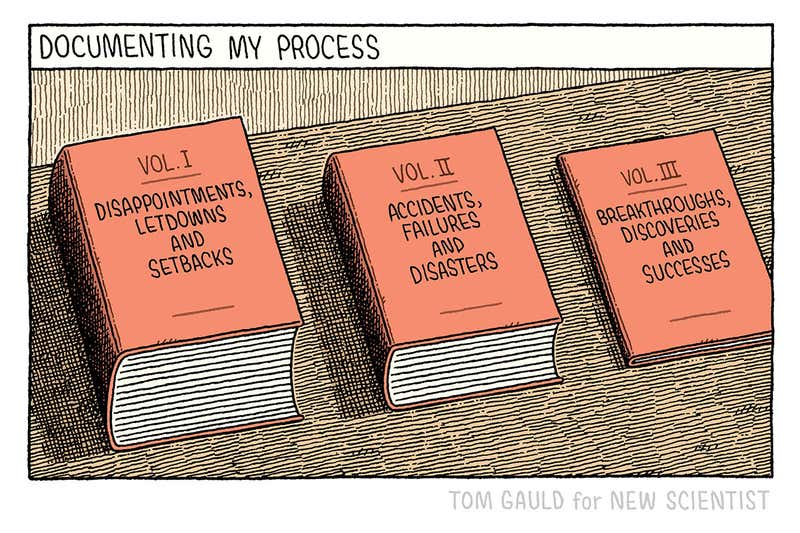

# Failure & Vulnerability

[2012: SpaceX: Elon Musk's race to space](https://www.youtube.com/watch?v=23GzpbNUyI4) \#video - "From PayPal to electric cars to rockets, billionaire entrepreneur Elon Musk wants his company, SpaceX, to build America's next manned spacecraft"

[CGP Grey was WRONG](https://www.youtube.com/watch?v=ua4QMFQATco) \#video

["Fear Makes Companions Of Us All" \| Listen \| Doctor Who](https://www.youtube.com/watch?v=ibL6Y0VN4Ys) \#video - "Clara has some advice about fear for a young doctor. Taken from the episode "Listen.""

[The Five Rules of Risk - YouTube](https://www.youtube.com/watch?v=NtX-Ibi21tU&feature=youtu.be)

[Is Most Published Research Wrong?](https://www.youtube.com/watch?v=42QuXLucH3Q) \#video - "Mounting evidence suggests a lot of published research is false."

[Mistakes](https://www.youtube.com/watch?v=Xz4S9aOm0kM&list=PLIilwIraDV2KXu0ZksOgeM7tyOrLwM_6m&index=9&t=0s) \#video - "Mistakes involving explosions..."

[Pentatonix Messing Up](https://www.youtube.com/watch?v=ZvFypZckHRc) \#video

[The Three Year Rule](https://www.youtube.com/watch?v=9HF2AjcXurA&feature=youtu.be) \#video

[A Video for Perfectionists \(and the value of Imperfect Space\)](https://www.youtube.com/watch?v=0mAKN7s6_qE&feature=youtu.be) \#video - "One of my mantras is quality over quantity. But that's a slippery slope down. Here are my thoughts on perfectionism, wabi sabi and creative output."

