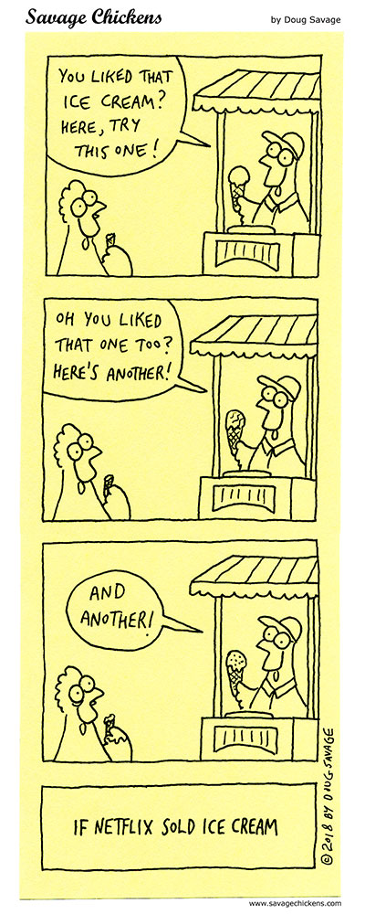

# Humane Tech

[Center for Humane Technology](https://humanetech.com/) - "Our mission is to reverse human downgrading by inspiring a new race to the top and realigning technology with humanity."

[Digital Minimalism - with Dr. Cal Newport](https://www.stitcher.com/podcast/paula-pant-and-j-money/money-103/e/58555559?refid=asa&autoplay=true) \#podcast - "Cal Newport created a philosophy called digital minimalism, which is idea of reducing your digital life down to only the most important core essentials. Remove the apps from your phone, then slowly re-introduce only the ones that are the most useful and beneficial. Take control of your smartphone, rather than letting it control you."

[Experiments with Google: Digital Wellbeing](https://experiments.withgoogle.com/collection/digitalwellbeing) - "A collection of ideas and tools that help people find a better balance with technology. We hope these experiments inspire developers and designers to consider digital wellbeing in everything they design and make. All the code is open sourced and helpful guides and tips are available to kick start new ideas. Try the experiments and create new ones. The more people that get involved the more we can all learn about building better technology for everyone."

[f.lux](https://justgetflux.com/) \#software - "f.lux ... makes the color of your computer's display adapt to the time of day, warm at night and like sunlight during the day."

[HOW I REPLACED FACEBOOK WITH "NICEBOOK"](https://elgan.com/blog/how-i-replaced-facebook-with-google-photos) \#article - "I’m replacing Facebook with a single shared folder in Google Photos I’m calling “Nicebook” — it’s all the nice features of Facebook, without the exploitative, racist, disinformation, censoring, advertising and other not-so-nice features of Facebook."

[How to Prevent the Internet From Taking Over Your Life: Digital Minimalism 06](https://www.youtube.com/watch?v=jEps2fnwL-0&feature=youtu.be) \#video - "It's way too easy now to let the internet be a part of every aspect of our lives. This was starting to have a really negative effect on me, so I decided to do something about it."

[Humane Tech Community](https://humanetech.community/) - "We are building the Pyramids of Humane Technology. We envision a future where we have unobtrusive technology that is empowering us and that allows humans to flourish and humanity to thrive. Where the digital world is a natural extension of the real one and a reflection of ourselves."

[iDramaLab](https://idrama.science/) - "The iDRAMA Lab is an international group of researchers interested in a variety of modern computing and socio-technical concerns. Collectively, we have published work ranging from genomic privacy, to cryptography and Web security, to distributed systems, and even video games. More recently, we have worked on understanding and mitigating modern socio-technological issues such as online harassment campaigns, hate speech and political radicalization, and understanding the subtle ways in which web communities influence each other."

[Intention](https://www.getintention.com/) \#extension - Chrome & Firefox. "Build the habit of focus. **Intention pauses distractions so you can scroll less and do more."**

[IRL Glasses](https://www.kickstarter.com/projects/ivancash/irl-glasses-glasses-that-block-screens/faqs) - "Glasses that Block Screens." Made by [IRL Labs](https://www.irl-labs.co/).

[LeftBlank.co](http://www.leftblank.co/) - "This page intentionally left blank."

[Pi-hole](https://pi-hole.net/) - "A black hole for Internet advertisements"

[Pomy](https://vanejung.com/pomy/) \#software - "Focus timer app for your eye health"

[Spend More Time Alone](http://www.calnewport.com/blog/2017/09/24/spend-more-time-alone/) \#article - by Cal Newport. "The right way to define “solitude” is as a subjective state in which you’re isolated from input from other minds. ... Regular doses of solitude are crucial for the effective and resilient functioning of your brain."

## Decentralization

[Beaker](https://beakerbrowser.com/) - "A browser for the
 next-generation Web
. Beaker is an experimental browser for exploring and building the peer-to-peer Web."

[Dat Protocol](https://www.datprotocol.com/) - "Dat is a new p2p hypermedia protocol. It provides public-key-addressed file archives which can be synced securely and browsed on-demand."

[Dat Protocol Foundation](https://dat.foundation/) - "Supporting the adoption and development of The Dat Protocol."

[Decentralised system - Wikipedia](https://en.wikipedia.org/wiki/Decentralised_system) \#article - "A **decentralised system** in [systems theory](https://en.wikipedia.org/wiki/Systems_theory) is a system in which lower level components operate on local information to accomplish global goals. The global pattern of behaviour is an [emergent property](https://en.wikipedia.org/wiki/Emergent_property) of dynamical mechanisms that act upon local components, such as indirect communication, rather than the result of a central ordering influence of a [centralised system](https://en.wikipedia.org/wiki/Centralised_system)."

[Imagine This: A Web Without Servers - Tara Vancil - JSConf EU 2018 - YouTube](https://www.youtube.com/watch?v=rJ_WvfF3FN8&feature=youtu.be) \#video - "The Web was envisioned as an open platform for publishing and sharing information, but that vision has been lost: most people will never publish independently on the Web. What went wrong?"

## Online Video

[DF Tube \(Distraction Free for YouTube™\) - Chrome Web Store](https://chrome.google.com/webstore/detail/df-tube-distraction-free/mjdepdfccjgcndkmemponafgioodelna) - "Allow yourself to focus while using YouTube™ for work, recreation or education."

[FreeTube](https://freetubeapp.io/) \#software - YouTube client that lets you turn off recommended videos, comments. [GitHub](https://github.com/FreeTubeApp/FreeTube)

[Invidious](https://invidio.us/) - Alternative portal to YouTube

[NewPipe](https://newpipe.schabi.org/) \#app - "the lightweight
 YouTube experience
 for Android"

[PeerTube](https://peertube.cpy.re/) \#webapp

[SkyTube](https://skytube-app.com/) \#app - "An open-source YouTube™ app for Android™."

## Phone Usage

[Before Launcher](https://play.google.com/store/apps/details?id=com.beforesoft.launcher) \#app - "Before Launcher helps us live in real life, and keeps our smartphone smart." \#android

[Daywise](https://getdaywise.com/) \#app - "Pick a schedule. Get notifications at those times. People who get notifications at set times are less stressed, calmer and more productive."

[Desert Island](https://play.google.com/store/apps/details?id=com.digitalwellbeingexperiments.desertisland) \#app - "Desert Island helps you find focus, by challenging you to go a day with only your essential apps. Simply pick the apps that are most important to you, then give it a go for 24 hours."

[Envelope ](https://play.google.com/store/apps/details?id=com.specialprojects.experiments.envelopecall)\#app - "An experimental app which temporarily transforms your phone into a simpler, calmer device. Currently supports Pixel 3a." [Printable PDF envelope](https://s3-eu-west-1.amazonaws.com/media.designersfriend.co.uk/sps/media/uploads/misc/downloads/google-unplugged-envelope-instructions.pdf). [GitHub](https://github.com/specialprojects-experiments/envelope).

[Forest](https://www.forestapp.cc/) \#app - "Stay focused, be present"

[Indistractable Launcher](https://play.google.com/store/apps/details?id=com.indistractablelauncher.android&hl=en_US) \#app - "The minimalist launcher \(Early Access\)"

[The Light Phone](https://www.thelightphone.com/) - "A phone is a tool, and it should serve you as the user, not the other way around. The Light Phone II is a phone that actually respects you."

[Mudita Pure](https://mudita.com/products/pure/) - "Modern take on a classic phone. Enjoy no distractions, an eye-friendly E Ink display, long battery life, ultralow SAR value and the features you need."

[OFFTIME ](https://play.google.com/store/apps/details?id=co.offtime.kit&hl=en_US)\#app - "OFFTIME lets you track and **customize your connectivity \(and limit phone usage\) so you can do the things that matter**. **Unplug**, **digital detox** and **focus** on your work, have **quality time** without distractions with the people you care about, or simply enjoy some peace of mind."

[Punkt MP01 Phone](https://www.punkt.ch/en/products/mp01-mobile-phone/) - "Distracted? Focus. Sometimes it’s good to take a break"

[Siempo](http://www.getsiempo.com/) \#app - Android launcher. "Use your tech, not the other way around. Let’s build a healthier relationship with our devices. Siempo puts you back in control of your apps and protects you from overuse."

## Social Networking

[Fabriq](https://www.ourfabriq.com/?utm_source=Iterable&utm_medium=email&utm_campaign=newsletter_4.9) \#app - "Get Intentional About Your Relationships"

[Houseparty](https://houseparty.com/?utm_source=Iterable&utm_medium=email&utm_campaign=newsletter_4.9) - "Houseparty
 is a
 face to face
 social
 network."

[Marco Polo](https://www.marcopolo.me/?utm_source=Iterable&utm_medium=email&utm_campaign=newsletter_4.9) \#app - "Unlike social media, there is no wasted time, no social comparisons and no likes! Connect with the most important people in your life, not the entire world."

