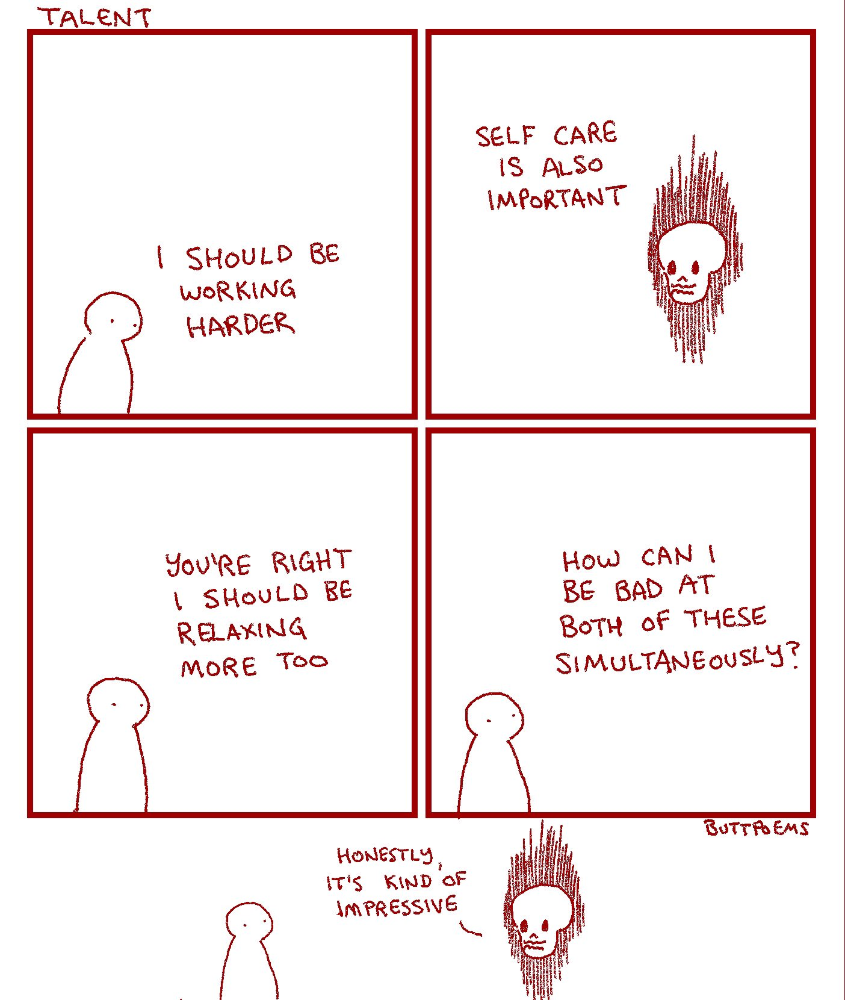

# Productivity

> **“If the ax is dull  
>     and its edge unsharpened,  
> more strength is needed,  
>     but skill will bring success”** \(Ecclesiastes 10:10, NIV\).

Tools and services which currently make up my systems:

* TaskWarrior
* Beeminder
* SimpleNote
* WorkFlowy
* Google Drive
* AirTable
* TagTime
* Custom python scripts
* GitBook

Tools I've used in the past:

* Habitica
* Todoist
* Things

## Links

[8,760 Hours](https://drive.google.com/file/d/0B2PaeRjVqAN7MngxTXFPQkpLVjg/view) \#pdf - "How to get the most out of the next year"

[clarissalittler/productive-while-mentally-ill](https://github.com/clarissalittler/productive-while-mentally-ill) \#book - "Repo for a short book on dealing with chronic mental illness while still trying to Get Things Done."

[Contexts](https://contexts.co/) \#software - "Switch between application windows effortlessly — with Fast Search, a better Command-Tab, a Sidebar or even a quick gesture. Includes fantastic features for multiple spaces & multiple displays."

[Digital Minimalism - with Dr. Cal Newport](https://www.stitcher.com/podcast/paula-pant-and-j-money/money-103/e/58555559?refid=asa&autoplay=true) \#podcast - "Cal Newport created a philosophy called digital minimalism, which is idea of reducing your digital life down to only the most important core essentials. Remove the apps from your phone, then slowly re-introduce only the ones that are the most useful and beneficial. Take control of your smartphone, rather than letting it control you."

[Flowstate](http://hailoverman.com/flowstate) - "Flowstate is guided by a simple philosophy: flow, then react. It is the first writing tool to emphasize the distinction between writing and editing. Unlike other writing programs, Flowstate features a sacred space for initial creation, with rigid laws enlisted to unleash a person's thoughts, feelings, and ideas like water."

[Fluid](https://fluidapp.com/) \#software - $5. "Fluid lets you create a Real Mac App \(or "Fluid App"\) out of any website or web application, effectively turning your favorite web apps into OS X desktop apps."

[How Minimalism Can Make You More Productive](https://www.youtube.com/watch?v=CttGNGjwp6A&feature=youtu.be) \#video - "One of the biggest benefits I’ve received from living a life with less, has been that I’ve been able to create more. In this video I break down five ways that I've applied minimalism to my work life."

[How to Get Motivated: A Guide for Defeating Procrastination](https://alexvermeer.com/getmotivated/) \#article - "I created a flowchart, to be printed in colour and posted somewhere visible, to help me _actually use_ the anti-procrastination advice I so desperately need!"

[MindMeister](https://www.mindmeister.com/) \#webapp - "Online Mind Mapping"

\_\_[_The Motivation Hacker_](http://www.nickwinter.net/the-motivation-hacker) \#book - "_The Motivation Hacker_ shows you how to summon extreme amounts of motivation to accomplish anything you can think of. From precommitment to rejection therapy, this is your field guide to getting yourself to want to do everything you always wanted to want to do."

[Numi](https://numi.io) \#software - "Beautiful calculator app for Mac"

"Plans are nothing; planning is everything" \(Dwight D. Eisenhower; [via BrainyQuote](https://www.brainyquote.com/quotes/dwight_d_eisenhower_149111)\).

[RageQuit.tips](https://ragequit.tips/) - "Don't let burnout make you quit! When work or the world make you feel like just quitting, this is place for tips, links and stories about coping with burnout."

[Setapp](https://setapp.com/) \#software - "The frontier platform that packs 140+ Mac apps into just one. A personally curated membership for $9.99/mo."

[Spend More Time Alone](http://www.calnewport.com/blog/2017/09/24/spend-more-time-alone/) \#article - by Cal Newport. "The right way to define “solitude” is as a subjective state in which you’re isolated from input from other minds. ... Regular doses of solitude are crucial for the effective and resilient functioning of your brain."

[Station](https://getstation.com/) \#software - "One app to rule them all. Station is the first smart browser for busy people. A single place for all of your web applications."

[TypeRacer](https://play.typeracer.com/)

[warner/magic-wormhole](https://github.com/warner/magic-wormhole) - "get things from one computer to another, safely"

[yEd](https://www.yworks.com/products/yed) \#software - "yEd is a powerful desktop application that can be used to quickly and effectively generate high-quality diagrams. Create diagrams manually, or import your external data for analysis. Our automatic layout algorithms arrange even large data sets with just the press of a button."

### Communication

[Juicy Mail](https://www.juicymail.co/) - "Introducing the next generation email experience"

[Slack Is Not Where 'Deep Work' Happens](https://blog.nuclino.com/slack-is-not-where-deep-work-happens?utm_source=hackernewsletter&utm_medium=email&utm_term=fav) \#article

[Spark](https://sparkmailapp.com/) \#software \#app - "The best personal email client. Revolutionary email for teams."

### Self-Care

### Sources

[Alex Vermeer](https://alexvermeer.com/blog/) \#blog - "I drink coffee, climb rocks, play go, and read books. I research and use tools for that improve my thinking, productivity, and life in general. I strive to reduce friction in my life, keep things minimal, and simplify. Sometimes I write."

[AlternativeTo](https://alternativeto.net/) - "Reviews, comments and recommendations."

[Cal Newport](http://www.calnewport.com/blog/) \#blog - "I'm a [computer science professor](http://people.cs.georgetown.edu/~cnewport/) who writes about the intersection of technology and society. I’m particularly interested in the impact of new technologies on our ability to perform productive work and lead satisfying lives. If you’re new to my writing, a good place to start is the [about page](http://calnewport.com/about/). You can access over a decade's worth of posts in the [blog archive](http://calnewport.com/blog/archive/)."

[Matt D'Avella](https://mattdavella.com/) - "Hi, my name’s Matt D’Avella. I’m a [filmmaker](http://minimalismfilm.com/), [YouTuber](http://youtube.com/mattdavella) & [podcaster](http://groundupshow.com/) that explores what it means to live a good life."

[Slant](https://www.slant.co/) - "TRUSTWORTHY PRODUCT RANKINGS FOR ALL YOUR SHOPPING NEEDS. Each month, over 2.8 Million people use Slant to find the best products and share their knowledge"

[Tim Ferriss](http://www.timferriss.com/) - "Tim Ferriss is a start-up angel investor \(Uber, Facebook, Twitter, Alibaba, etc.\), [blogger](http://www.fourhourworkweek.com/blog), and entrepreneur. His best-known written work is [The 4-Hour Workweek](http://www.amazon.com/4-Hour-Workweek-Escape-Live-Anywhere/dp/0307353133/ref=pd_bbs_1?ie=UTF8&s=books&qid=1203371924&sr=8-1), which had been sold into 35 languages and reached \#1 on The New York Times, BusinessWeek, and The Wall Street Journal bestseller lists.  On May 3, 2009, it celebrated its 2nd straight year on The New York Times business bestseller list since its publication on April 27, 2007."

